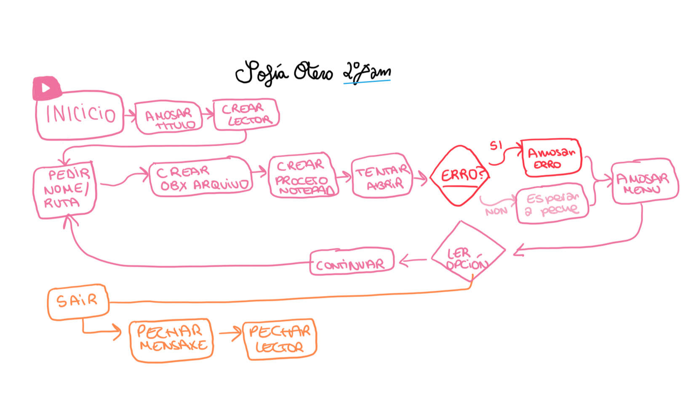

# TAREA 3 - Editor de Arquivos con Bloc de Notas
**Desenvolvido por**: Sofía Otero  
**Asignatura**: PSP  
**Versión**: 1.1
## 📋 Descrición

Este programa permite crear ou editar arquivos de texto utilizando o Bloc de Notas (Notepad) de Windows dende a liña de comandos. Desenvolvido en Java. 

## 🔧 Funcionamento

O programa solicita ao usuario unha ruta ou nome de arquivo, abre o Bloc de Notas co arquivo indicado e, ao pechar o editor, pregunta se se quere continuar traballando noutro arquivo ou saír do programa.

## 📝 Pseudocódigo

```
INICIO
    MOSTRAR "CREA OU EDITA OS TEUS ARQUIVOS - Sofía Otero"
    
    MIENTRAS verdadeiro FACER
        PEDIR "Escribe a ruta ou nome do teu arquivo: "
        LER rutaArquivo
        
        CREAR obxeto File con rutaArquivo
        PREPARAR ProcessBuilder para executar "notepad" coa ruta absoluta
        
        INTENTAR
            INICIAR proceso do Bloc de Notas
            AGARDAR a que o usuario peche o Bloc de Notas
        CAPTURAR erros de E/S ou interrupción
            MOSTRAR mensaxe de erro
        
        PREGUNTAR "Qué queres facer agora?"
        MOSTRAR opcións:
            1. Traballar noutro arquivo
            2. Saír
        
        LER opción do usuario
        SE opción é "2" ENTÓN
            MOSTRAR "Pechando <3"
            SAIR do bucle
        FIN SE
    FIN MIENTRAS
    
    CERRAR scanner de teclado
FIN
```
## 📚 Fontes Consultadas
- Apuntes de clase
- [String.trim() - W3API](https://www.w3api.com/Java/String/trim/)
- [Process.waitFor() - TutorialsPoint](https://www.tutorialspoint.com/java/lang/process_waitfor.htm)
- [InterruptedException - Baeldung](https://www.baeldung.com/java-interrupted-exception)
- https://campusvirtual.ull.es/ocw/pluginfile.php/15444/mod_resource/content/1/Tema%205.%20Manejo%20de%20ficheros%20en%20Java.pdf


