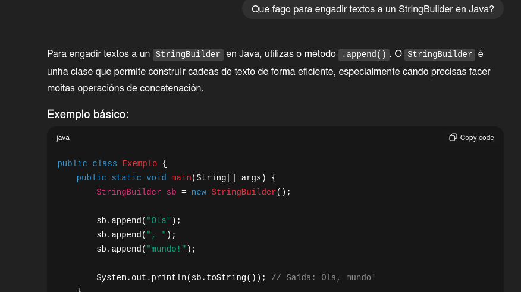
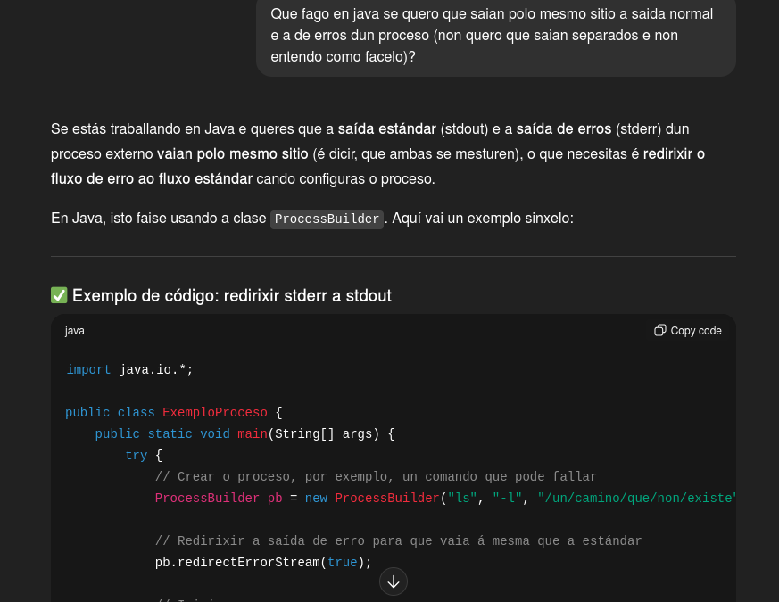
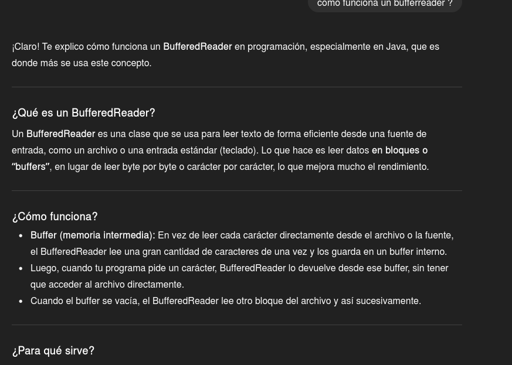

# TAREA 06 - Programa para facer PING

**Desenvolvido por**: Sofía Otero

**Asignatura**: Programación de Servizos e Procesos (PSP)

**Versión**: 1.1

## 📋 Descrición

Programa, feito en Java, adícase a facer ping a unha IP ou enderezo que queiramos.

Realiza o seguinte: 

O programa principal pide un enderezo e lánzalle o ping ao sistema . Logo recolle todo o que di o ping e amósao nunha ventana. Non necesitas abrir o terminal para usalo.

## ✅ Funcionalidade Implementada

### Nivel 1 

* Fai o comando ping, limitado a 4 paquetes.
* Capta todo o resultado que dá o comando.
* Amosa o código de saída ao final para saber se foi ben (0) ou mal.

### Nivel 2 

* Revisa o resultado e pon prefixos en cada liña.

### Mellora Extra (Nivel extra)

* Engadín unha ventá de interface . Isto é para que o usuario non teña que usar o terminal, que era o obxectivo de parte do Nivel 3, pero que non puiden completar adecuadamente.
* Custoume moito porque nunca manexara a ferramenta Swing e tiven varios problemas de rendemento, empreguei varias fontes 
* para tratar de facelo, tanto documentación Oracle coma exemplos con IA (sobre todo para xestionar o tamaño). Aínda que non e tan rápida como me gustaría
* realiza correctamente a función de evitar que o usuario empregue unha terminal.

## O que non puiden facer 

Non fun capaz de facer o Nivel 3 Guardar en Ficheros.

O máis difícil pra min foi conseguir que a información do ping se guardase separada en dous ficheiros á vez (un para o que saía ben e outro para os erros).
Tratei de evitar este problema facendo a ventana , pero non conseguín que os datos se gardasen en ficheiros como na tarea.

## 📚 Fontes Consultadas

* Apuntes de clase
* [[https://docs.oracle.com/javase/8/docs/api/java/io/BufferedReader.html](https://docs.oracle.com/javase/8/docs/api/java/io/BufferedReader.html)]
* [[https://docs.oracle.com/javase/8/docs/api/java/io/InputStreamReader.html](https://docs.oracle.com/javase/8/docs/api/java/io/InputStreamReader.html)]
* [[https://docs.oracle.com/javase/8/docs/api/java/lang/Process.html](https://docs.oracle.com/javase/8/docs/api/java/lang/Process.html)]
* [[https://man7.org/linux/man-pages/man8/ping.8.html](https://man7.org/linux/man-pages/man8/ping.8.html)]
* [[https://docs.oracle.com/javase/8/docs/api/java/lang/ProcessBuilder.html\#redirectErrorStream(boolean](https://www.google.com/search?q=https://docs.oracle.com/javase/8/docs/api/java/lang/ProcessBuilder.html%23redirectErrorStream\(boolean\))]
* [[https://docs.oracle.com/javase/8/docs/api/java/lang/StringBuilder.html](https://docs.oracle.com/javase/8/docs/api/java/lang/StringBuilder.html)]
* [[https://docs.oracle.com/javase/8/docs/api/java/io/BufferedReader.html\#readLine](https://docs.oracle.com/javase/8/docs/api/java/io/BufferedReader.html#readLine)()]
* [[https://docs.oracle.com/javase/8/docs/api/java/lang/Appendable.html\#append-char-](https://docs.oracle.com/javase/8/docs/api/java/lang/Appendable.html#append-char-)]
* [[https://docs.oracle.com/javase/8/docs/api/java/lang/Process.html\#waitFor](https://docs.oracle.com/javase/8/docs/api/java/lang/Process.html#waitFor)()]
* [[https://www.baeldung.com/java-interrupted-exception](https://www.baeldung.com/java-interrupted-exception)]
* [[https://docs.oracle.com/javase/8/docs/api/javax/swing/JOptionPane.html](https://docs.oracle.com/javase/8/docs/api/javax/swing/JOptionPane.html)]
* [[https://docs.oracle.com/javase/8/docs/api/javax/swing/JTextArea.html](https://docs.oracle.com/javase/8/docs/api/javax/swing/JTextArea.html)]
* [[https://docs.oracle.com/javase/8/docs/api/javax/swing/JScrollPane.html](https://docs.oracle.com/javase/8/docs/api/javax/swing/JScrollPane.html)]
* [[https://docs.oracle.com/javase/8/docs/api/java/awt/Color.html](https://docs.oracle.com/javase/8/docs/api/java/awt/Color.html)]
* [[https://docs.oracle.com/javase/8/docs/api/java/lang/String.html\#equalsIgnoreCase(java.lang.String](https://www.google.com/search?q=https://docs.oracle.com/javase/8/docs/api/java/lang/String.html%23equalsIgnoreCase\(java.lang.String\))]
* [[https://www.w3api.com/Java/String/trim/](https://www.w3api.com/Java/String/trim/)]
* **Prompts empregados:**
* 
* 
* 
