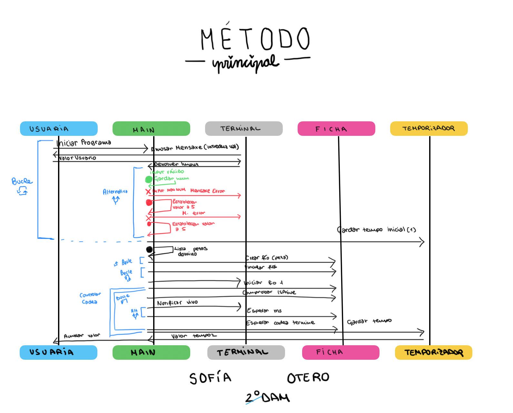
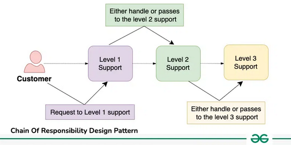
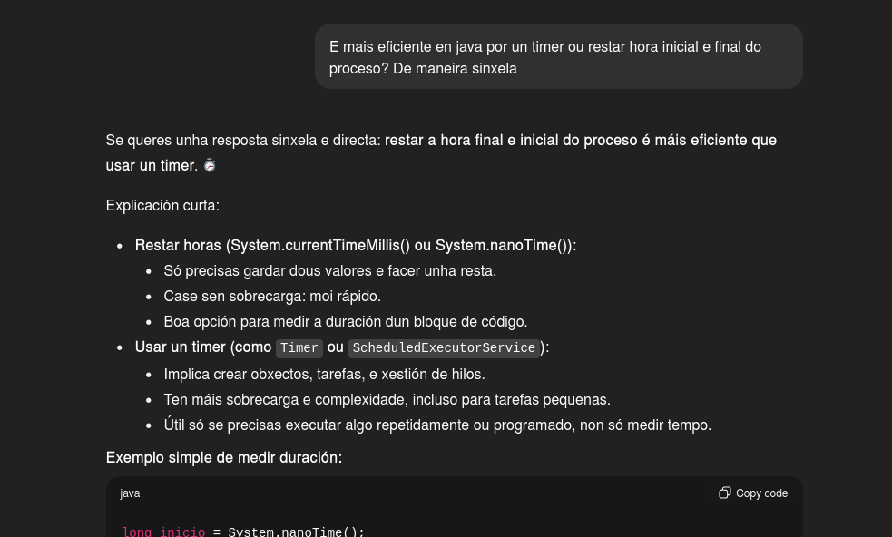
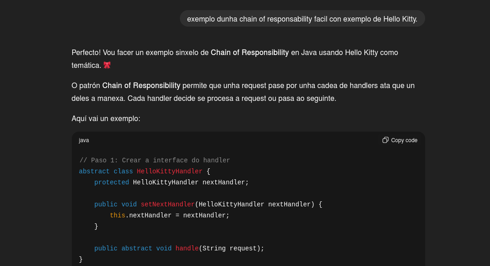

# TAREFA 11 - DOMINÓ CON FIOS

**Desenvolvido por**: Sofía Otero

**Asignatura**: Programación de Servizos e Procesos (PSP)

**Versión**: 1.0

## 📋 Descrición
Tentei simular o efecto dominó empregando fíos, de modo que cada ficha que cae lanza á seguinte, creando unha cadea de responsabilidade.Xestiono cantas fichas haberá, comprobando que o valor sexa correcto, e o programa principal vixia periodicamente a primeira ficha. Ao final, indica canto tempo durou toda a caída en milisegundos.
## ⚃ Idea Inicial / Esquema da Tarefa
Idea orixinal que desenvolvín para tratar de implementar a tarefa, non se corresponde totalmente co resultado final:

## ✅ Funcionalidades Implementada

### Nivel 1
Creei a clase FichaDomino que estende Thread e definín a súa lóxica interna de caída, que consiste en iniciar o seguinte fío e despois esperar a que este remate (con join()) antes de que a ficha actual se dea por finalizada. Esta clase implementa o manexador do patrón Chain of Responsibility.
### Nivel 2
Creei un Scanner no método principal para que o usuario introduza o número de fíos. Xestionei a validez do dato introducido cun try e dous catch:

No caso de que se introducise unha letra ou un carácter non numérico, empreguei InputMismatchException e asignei un valor por defecto de 5.

No caso de que se introducise un número menor ou igual a 0, lancei unha IllegalArgumentException e tamén asignei o valor por defecto de 5.
### Nivel 3
Aínda que cheguei carios resultado para desenvolver este nivel, finalmente decidín crear dúas variables que rexistrasen o tempo de inicio e o de fin empregando System.nanoTime(). Restei estas dúas variables para obter a diferencia, que é o tempo total empregado na simulación. Esta diferenza foi convertida a milisegundos para o tempo final.

Para saber se o meu fío está vivo empreguei o método isAlive() que me permitirá saber se o proceso está vivo ou non e imprimirá o seu resultado. Esta comprobación farase cada 200 ms.

### Mellora Extra (Nivel extra)
Mentres pensaba como desenvolver o código, que foi o que máis tempo me levou, deime conta de que era necesario traballar cun patrón de desenvolvemento. Facíaseme tedioso xestionar os fíos sen unha organización, así que, tras buscar un tempo, atopei o patrón Chain of Responsibility (Cadea de Responsabilidade). Fíxome moito sentido empregalo, xa que se centra en que elemento sucede a cada un sen ter que tratar a totalidade dunha vez.

Tras realizar varios esquemas, establecín que cada ficha de Domino funcionase como un manexador, séndolle necesario só saber quen é a ficha que ten diante dela.

#### Exemplo de un desenvolvemento realizado seguindo este patrón:

#### No código funciona así:

En FichaDomino, só programei a lóxica para que o fío lance ao seu sucesor e espere a que remate. Non é necesario saber o número total de fichas.

A cadea construína na clase principal. Con setSiguienteFicha() unín as fichas unha por unha, establecendo a orde.

#### Conclusión:

Non me resultou nada sinxelo facer isto, xa que normalmente non acostumamos a traballar seguindo un patrón. Pero como nas prácticas se me plantexou varias veces a necesidade de seguir un, semelloume un reto persoal conseguilo con este exercicio. Creo que, como resultado xeral, está medianamente conseguido, aínda que me queda un montón de cousas por aprender e mellorar.
## 📚 Fontes Consultadas
* Clase Thread : [Documentación oficial de Java sobre java.lang.Thread](https://docs.oracle.com/javase/8/docs/api/java/lang/Thread.html)
* Clase Timer : [Documentación oficial de Java sobre java.util.Timer](https://docs.oracle.com/javase/8/docs/api/java/util/Timer.html)
* InterruptedException: [Documentación oficial de Java sobre java.lang.InterruptedException](https://docs.oracle.com/javase/7/docs/api/java/lang/InterruptedException.html)
* Thread.join(): [Como usar Thread.join() (makigas.es)](https://www.makigas.es/series/concurrencia-en-java/como-usar-thread-join)
* InputMismatchException: [Erro InputMismatchException en Java (keepcoding.io)](https://keepcoding.io/blog/error-inputmismatchexception-en-java/)
* IllegalArgumentException: [How to handle IllegalArgumentException in Java (labex.io)](https://labex.io/es/tutorials/java-how-to-handle-illegalargumentexception-in-java-417309)
* Conversión de Unidades de Tempo: [Conversor de milisegundos a nanosegundos (xconvert.com)](https://www.xconvert.com/unit-converter/milliseconds-to-nanoseconds)
*  Guia sobre Chain of Responsability [Chain of Responsability Refactoring Guru](https://refactoring.guru/design-patterns/chain-of-responsibility)

