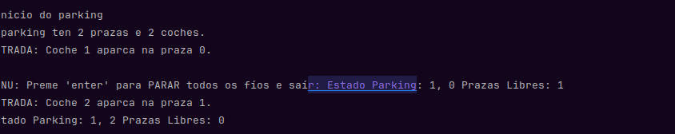
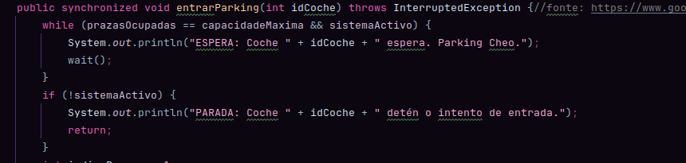
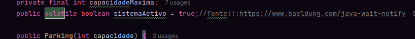
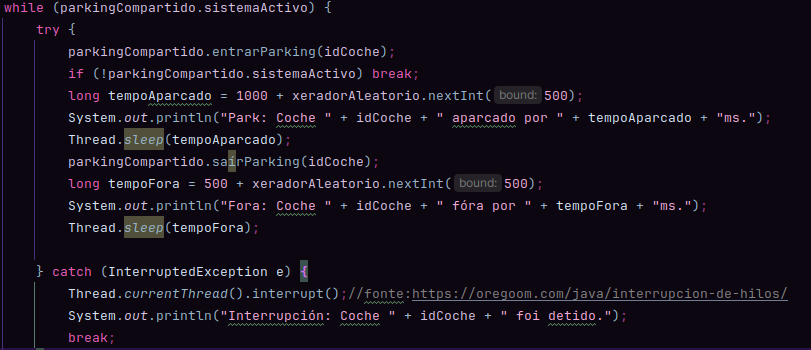
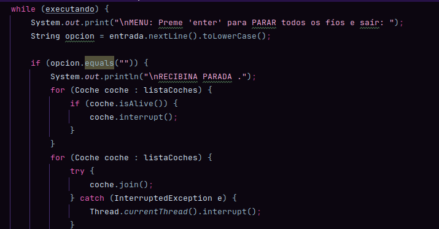
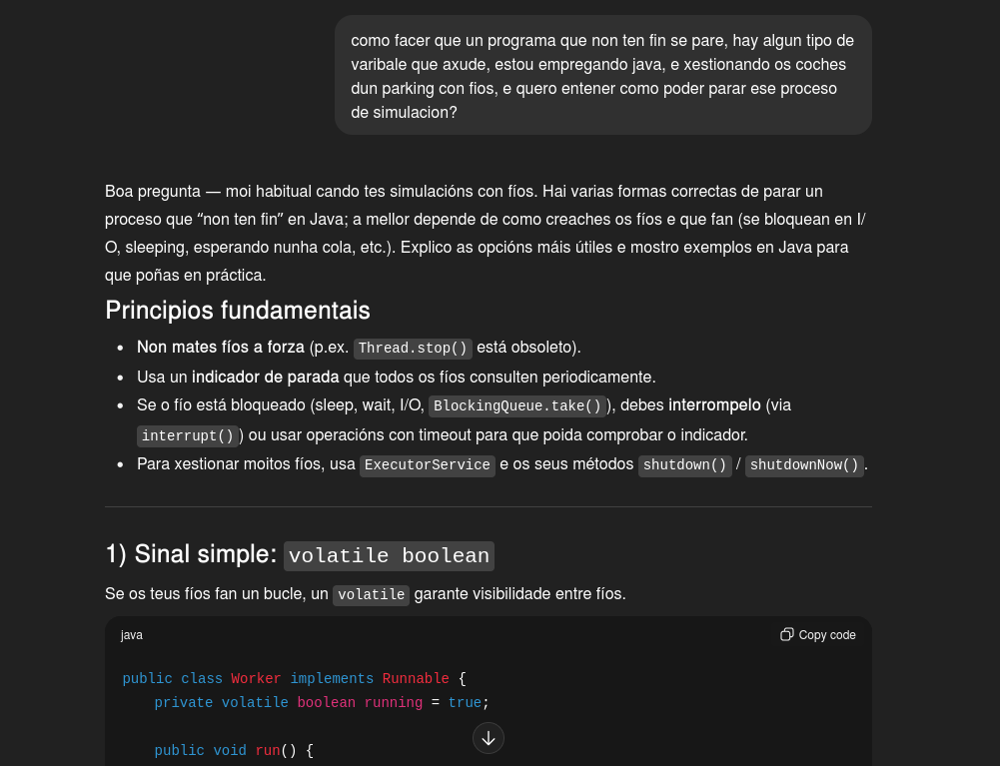

# TAREFA OPTATIVA 21 - PARKING

**Desenvolvido por**: Sofía Otero

**Asignatura**: Programación de Servizos e Procesos (PSP)

**Versión**: 1.0

## 📋 Descrición

Tentei realizar un programa de xestión de parking con fíos. No que cada fío representa un coche. Nel 
a través dun scanner o usuario introduce o número de prazas e coches cos que vamos a traballar.

Logo con fíos, sincronizacón, simulo a súa xestión, o parking funciona coma un recurso compartido de varias prazas, limitadas,
ao que un número fíos determinado polo usuario tentan acceder.
Fundamentalmente, centreime en limitar que un solo coche pudese entrar si hai prazas disponibles e empreguei wait() e 
notifyAll() pra xestión de libreación de prazas. Como elemento extra engadín un menú pra usuario e a posibilidade de
parar o programa coa tecla "enter".

## ✅ Funcionalidades Implementadas
### Clase Parking 

Funciona como recurso compartido, como se indicaba no enunciado, xestiona o estado das prazas e a sincronización.
Emprega un array estadoPrazas no que 0 dinos que hai unha praza libre, e, outro número positivo (id do coche) indícanos
que está ocupada.

Pra desenvolver esta clase empreguei dous métodos sincronizados entrarParking() e sairParking() coa
intención de que só un fío acceda e cambie o array ou o estado do contador de prazas ocupadas á vez. Diseñei esto
pra evitar as condicións de carreira. 

Tamén empreguei volatile pra poder parar o programa. 

### Clase Coche
Con ela extendo a clase thread() e representa un fío independente. run() ten un bucle infinito que representa o proceso
do coche pedido no exercicio:

1. tratar de entrar no parking entrarParking
2. Crea un tempo de aparcado con sleep
3. Sae do parking sairParking.
4. Simula o tempo fora tamén con sleep

Só deteño isto cando sistemaActivo é False ou o fío se interrompeu.

### Clase estructura 

Configura a miña simulación de parking lendo as prazas e coches cun scanner. Pon en marcha os fíos. Inclúe un menú
de control que se executa nun bucle e agarda unha entrada. 

Se detecta unha liña vacía, é decir, se se presiona "enter" 
inicia a parada. Na que se lle di a clase parking que marque sistemaActivo = False que iterará sobre todolos fíos con
interrupt pra quitarlos de calquera estado de sleep o wait. pra rematar agarda a que todos rematen cun join().

## Cómo sincronicei todo?
### bloqueos sincronizados
Os métodos entrarParking e sairParking declareinos como public syncronized. Esto fai que o fío colla un monitor de parking
antes de correr o código. Este mecanismo asegura que só un fío acceda á vez a unha parte fundamental, garantendo a 
atomicidade e prevendo a alteración dos meus datos. 
### Espera
En entrarParking usei wait(dentro de un while). Se o parking está cheo, o coche chama a wait() o fío libera un monitor 
e logo pasa a estado de espera. Fixen esto pra permitir cun coche poda acceder a sairParking e liberar unha praza. Xa que, while 
obriga a comprobar a condición después de ser espertado.
### Notificar
sairParking chama a notifyAll() tras liberar unha praza, fai que se liberen todos os fios que están bloqueados. 
sérveme pra asegurar que todos os coches que esperan volvan competir por unha praza liberada, pra mellorala distribución

## Fontes
https://www.google.com/url?sa=t&source=web&rct=j&opi=89978449&url=https://www.makigas.es/series/concurrencia-en-java/bloque-synchronized&ved=2ahUKEwi96_Se372QAxXNhP0HHU-WFGcQFnoECB0QAQ&usg=AOvVaw19VN9c3crDx2GqDN1GHaqR
https://oregoom.com/java/interrupcion-de-hilos/
https://www.baeldung.com/java-wait-notify

