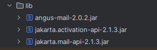
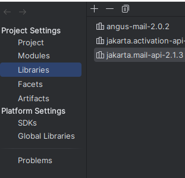
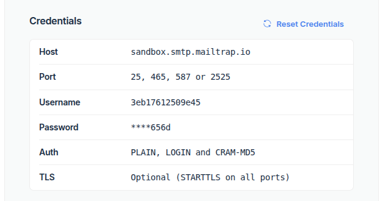
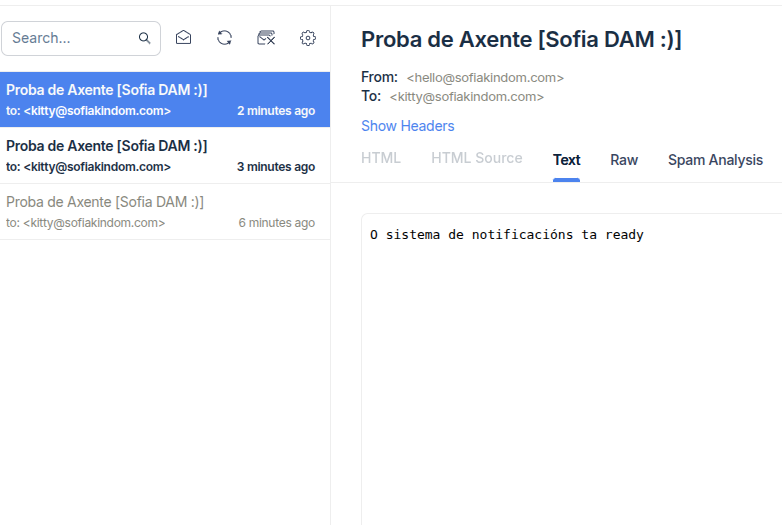
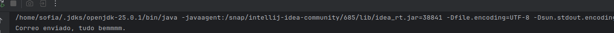

# [OPTATIVA] Tarea 36
## Qué fai?

Configurei os axustes de conexión para usar as miñas credenciais. Primeiro, realicei o envío dun correo electrónico a través do servidor SMTP de Mailtrap . Despois, conectei á bandexa de entrada mediante o protocolo POP3 para ler e mostrar os correos máis recentes.

https://youtube.com/shorts/85PCkZeV_j8?si=A5kUsOEFaGhAJKr9

## Importante para que funcione

É fundamental que teñas estos drivers na carpeta lib do teu proxecto, senón non che vai funcionar.

Debes engadilos tamén no project structure no apartado libraries.

Tamén tes que crear unha conta de Mailtrap, e para este código, crear un sandbox e cambiar as credencias do meu usuario sofia polas túas. Estos datos velos unha vez creado o sandbox clicando nel.

Configura correctamente o SAndbox senón terás problemas coa lectura por terminal.

## O programa 

